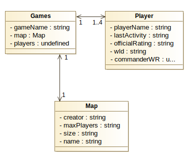

# Explicación WebScrapping

Antes de ejecutar el código es necesario especificar la ubicación donde se encuentra descargado el navegador que se quiere utilizar.

También se debe especificar la página de la que se quieren robar datos. En este caso ambas especificaciones ya se encuentran asignadas.

Ya con esos parametros especificados (Si se querían cambiar por alguna razón), solamente se debe ejecutar el código desde la clase Main y en unos pocos minutos ya se tendrá la información guardada.

### Detalles importantes

Este código lo que hace es recoger los datos de todas las partidas que se encuentren **ACTUALMENTE EN PROGRESO**.

Con esto quiero destacar que existe la posibilidad de que al lanzar el scrap, no recoga ningún dato, pues, si esto ocurre será porque no hay partidas actualmente en progreso.

Por ello he dejado creados unos archivos tanto CSV como XML llamados "prueba." Y la extensión.

Si aun así se quiere ver como obtiene los datos, se me puede enviar un correo para crear partidas de prueba.

### **Aquí dejo adjuntada una imagen indicando el diagrama de clases de este proyecto:**

 